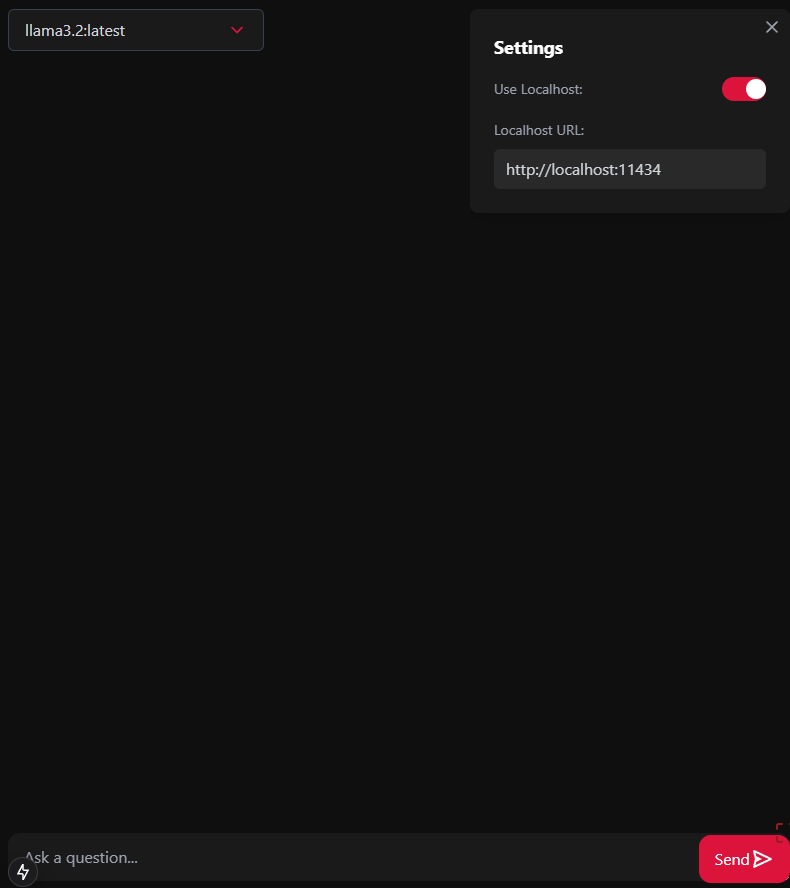
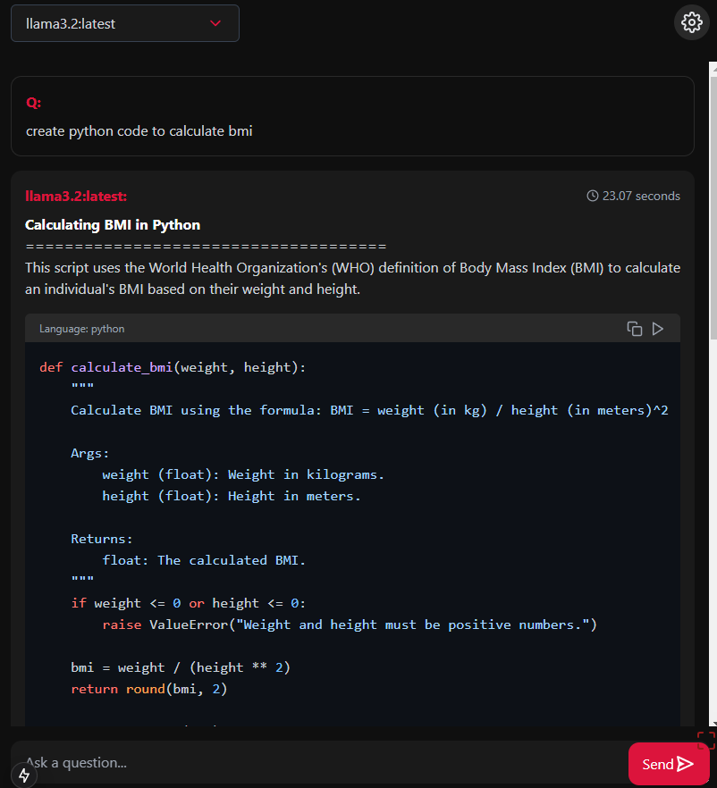
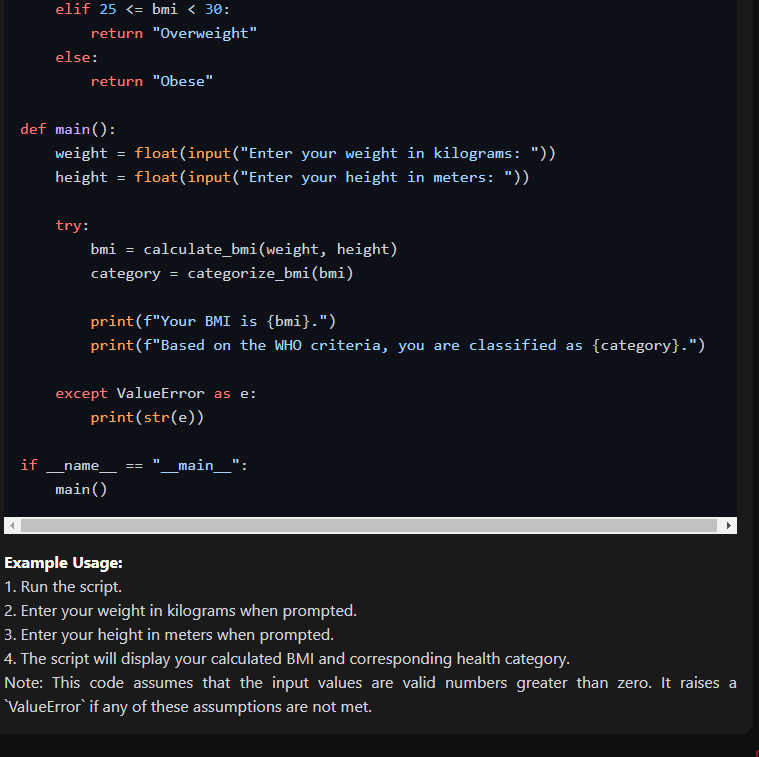

# Ollama Chat Bot App

## About the Project

The Ollama Chat Bot App is a feature-rich chat application that enables users to interact seamlessly with a chatbot. Designed to be versatile and user-friendly, the app connects to local and remote Ollama APIs, offering a customizable and dynamic chat experience. With its ability to process and respond to user inputs, it serves as a robust platform for chatbot interactions, supporting multiple models and advanced features like executing Python code snippets.

## Features

- **Intuitive Chat Interface:** Communicate with the chatbot through a responsive web interface.
- **Server Configuration:** Easily configure the server URL for the backend service.
- **Multi-Model Support:** Connect to multiple Ollama API models for diverse functionalities.
- **Code Execution:** Run Python code snippets directly within the chat.
- **Syntax Highlighting:** View code blocks with enhanced readability using syntax highlighting.
- **One-Click Code Actions:** Copy and execute code snippets straight from the chat interface.

## Prerequisites

Before setting up the project, ensure the following requirements are met:

- **Node.js and npm/yarn:** Installed on your system. Download [Node.js](https://nodejs.org/).
- **Python:** Installed on your machine. Download [Python](https://www.python.org/).
- **Ollama API:** Installed and configured on a local or remote server.
- **Models:** Required models downloaded for the Ollama API.

## Getting Started

Follow these steps to set up and run the Ollama Chat Bot App:

### 1. Clone the Repository

```bash
git clone https://github.com/your-username/ollama-chat-bot-app.git
cd ollama-chat-bot-app
```

### 2. Configure Environment Variables

Create a `.env` file in the root directory and add the following variable:

```env
NEXT_PUBLIC_OLLAMA_URL=http://your-server-ip:port
# Example:
# NEXT_PUBLIC_OLLAMA_URL=http://192.168.178.230:11434
```

Replace `http://your-server-ip:port` with the URL of your Ollama API server.

### 3. Install Dependencies

Install the necessary dependencies using your preferred package manager:

```bash
npm install
# or
yarn install
# or
pnpm install
```

### 4. Start the Development Server

Run the development server:

```bash
npm run dev
# or
yarn dev
# or
pnpm dev
```

Open [http://localhost:3000](http://localhost:3000) in your browser to view the app. The application supports hot-reloading, allowing real-time updates as you edit the source code.

## Configuring the Ollama API

To leverage the full potential of the chatbot, set up the Ollama API on your local or remote server:

1. **Install Ollama API:** Follow the installation guide on the [Ollama API GitHub repository](https://github.com/ollama/ollama).
2. **Download Models:** Acquire the required models specified in the Ollama API documentation.
3. **Start the API Server:** Run the Ollama API server and ensure it is accessible at the URL defined in your `.env` file.

Example:

```bash
ollama start
```

Verify the server is running by accessing the API URL in your browser or via a tool like Postman.

## Project Structure

- **`pages/`**: Contains the main application files and routes.
- **`components/`**: Reusable UI components for the chat interface.
- **`utils/`**: Utility functions, including API calls and helper methods.
- **`styles/`**: Styling files for the application.

## Screenshots

### Application Interface

[](image1.png)

### Python Code Execution Example

[](image2.png)
[](image3.png)
</div>

## Contributing

Contributions are welcome! To contribute:

1. Fork the repository.
2. Create a new feature branch:

   ```bash
   git checkout -b feature/your-feature-name
   ```

3. Commit your changes:

   ```bash
   git commit -m "Add your message here"
   ```

4. Push to the branch:

   ```bash
   git push origin feature/your-feature-name
   ```

5. Open a pull request.

## License

This project is licensed under the MIT License. See the `LICENSE` file for details.
